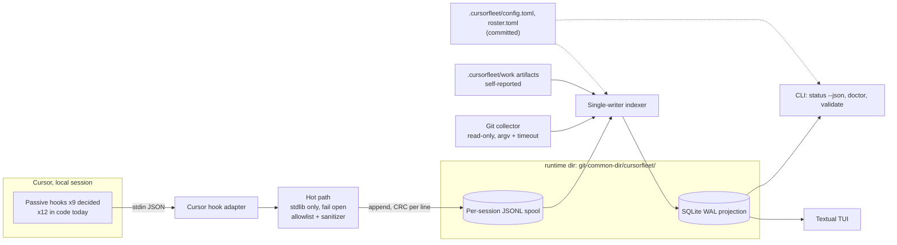

# Architecture (v0.1 Observe)

Statuses: **PROVISIONAL** items depend on Cursor behavior not yet captured live
([ADR 0001](adr/0001-cursor-capabilities.md), section B). The implementation is
provisional and unvalidated against live Cursor; where it differs from an accepted ADR the
difference is marked **Divergence** and listed in [follow-ups](follow-ups.md).

## Data flow

## Components

- **Hook adapter** (`cursorfleet.adapters.cursor`): maps Cursor hook names to
  normalized events. `hook_policy.py` holds `ALLOWED_V01_HOOKS`,
  `FORBIDDEN_HOOKS` and the fail-open replies. Adapter-ready: a second IDE would
  add a sibling package emitting the same events. **Divergence:**
  [ADR 0007](adr/0007-narrower-v01-hook-policy.md) decides nine hooks; the code lists twelve.
- **Hot path**: the `cursorfleet hook <event>` entrypoint (M2). Rules: stdlib
  only, lazy imports, no pydantic/typer/textual even transitively, no network,
  exits 0 with `{}` (`{"permission":"allow"}` for permission hooks) on any error,
  steady-state p95 <= 60 ms (process wall time including interpreter startup, outside Cursor; [`hook-latency.md`](hook-latency.md)). It parses with a per-hook allowlist, sanitizes
  commands and paths, and appends one line to the spool.
- **Spool**: one JSONL file per session writer, each line `<crc32> <json>`.
  Torn tails and bad CRCs are skipped and counted. Telemetry is best-effort: an append can
  fail or be skipped without notice, so the spool can have gaps. Layout in
  [ADR 0002](adr/0002-storage-layout-and-runtime-directory.md) (**PROVISIONAL**
  until Q5 is answered).
- **Indexer**: the only writer to SQLite. Tails the spool, reduces events into
  tables, holds an advisory lock so only one indexer runs
  (`indexer.lock`; the full cross-platform lock spec and a separate maintenance lock for
  purge are in ADR 0002 and not yet implemented). Runs inside the TUI
  or as `cursorfleet index`. Hooks never open the database.
- **Projection**: SQLite in WAL mode, rebuildable from the spool (`replay`);
  a corrupt database is quarantined (renamed, not deleted) and rebuilt. Reducer semantics:
  [ADR 0010](adr/0010-reducer-state-semantics.md). Worktree ids are keyed (HMAC) and segment
  fingerprints use BLAKE2s per ADR 0002; **Divergence:** the code still uses an unkeyed
  SHA-256 worktree id and a CRC32 fingerprint.
- **Git collector**: read-only `git` calls (argv list, timeout, no fetch) for
  branch, HEAD, dirty count, ahead/behind from existing refs and stale detection.
  Its snapshots are projection state, not replayed events. Lets the TUI work with zero telemetry.
- **Events table** (`state/event_store.py`): the indexer also stores each validated event
  (plus indexed columns) so the TUI timeline can filter and page in SQL. Additive; an older
  database is reindexed once.
- **Artifact scanner** (`state/artifact_scan.py`): read-only, run by the TUI on each refresh
  (not by the indexer, so artifacts are not persisted). Valid `.cursorfleet/work` artifacts
  become in-memory `self_reported` events; invalid ones become fixed-text problems. See
  [tui.md](tui.md).
- **CLI/TUI**: read the projection; show `source` and `attribution` on every
  agent-attributed item; render "unknown / no telemetry" explicitly.

## Models and the hot path

- Pydantic v2 models in `cursorfleet.config` and `cursorfleet.events.models` are
  the source of truth; `schemas/*.json` are generated from them
  (`scripts/gen_schemas.py`) and a test fails on drift.
- Stdlib-only vocabulary the hot path may import: `events.kinds`, `events.ids`,
  `events.forbidden`, `events.pathcheck`, `adapters.cursor.hook_policy`. A test
  asserts importing them loads no pydantic, typer, textual or network module.
- The hot path will **re-implement validation with the stdlib** rather than
  import the models. Contract tests feed hot-path output through
  `Event.model_validate` (and the JSON Schema) so the two cannot diverge.

## Locations

- **Runtime dir:** `git rev-parse --git-common-dir` resolved to an absolute real
  path, then `<common-dir>/cursorfleet/`. Shared by every worktree of the repo
  and untracked by construction. Hooks run from the worktree root, so a
  working-tree runtime dir would split state per worktree. **PROVISIONAL** (Q4).
- **Committed config:** `.cursorfleet/config.toml`, `.cursorfleet/roster.toml`,
  `.cursorfleet/work/<task>/` (agent-declared artifacts).
- **Cursor files we generate:** `.cursor/hooks.json` entries, `.cursor/agents/*.md`,
  `.cursor/rules/*.mdc`, skills, with a lockfile of installed hashes.

## Identity and attribution (PROVISIONAL)

- Field map: `conversation_id` to `session_id`, `generation_id` kept,
  `subagent_id` to `agent_instance_id`, `subagent_type` to `agent_role` (mapped
  to a roster id when it matches), `agent_id` derived.
- `attribution` is exactly `exact | inferred | unknown` (ADR 0003 section 2). `exact` needs a
  unique current instance identified or deterministically linked; a role-only identity is
  `inferred`; parent-only or nothing is `unknown`. If tool hooks inside subagents carry no
  instance identity (Q1), those events are `inferred` (role only) or `unknown`. Fallbacks are
  `tool_use_id` linkage (exact only if the spike verifies it), worktree identity (only with
  isolation, `inferred`) and self-reported artifacts. Temporal attribution is unsafe with
  parallel subagents and uses `inferred`; v0.1 does not emit it.
- `subagentStop` has no documented `subagent_id`; start/stop pairing may need
  type plus ordering.

## Failure behavior

- Hook errors: swallowed, correct fail-open reply, exit 0.
- Missing `cursorfleet` binary on a teammate's machine: observe-only hooks are
  noise, never a block.
- Corrupt spool line or SQLite file: skipped/quarantined; TUI keeps running;
  `replay` rebuilds.
- Non-git workspace: v0.1 requires a git repo; the hook records nothing and
  `doctor` explains (ADR 0002).
