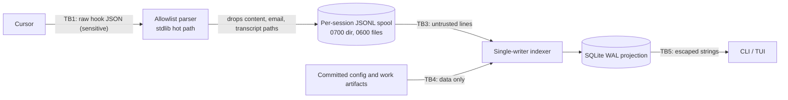

# Threat model (v0.1 Observe)

**Guardrails are not a security boundary.** v0.1 observes; it blocks nothing.
Hooks fail open by design, agents run as the same OS user, and a hostile agent
can edit or delete hook config, the spool and the projection. Treat everything
CursorFleet displays as best-effort telemetry, not evidence of safety.

Scope: local Cursor sessions on one developer machine. Cloud agents are out of
scope (their hooks never reach us).

## Assets

- **A1 Workspace code and secrets.** Read by hooks only as payload fields in
  memory (`afterFileEdit.edits`, `afterShellExecution.output`).
- **A2 Conversation content.** Prompts, thinking, responses, task text, summaries.
- **A3 User identity.** `user_email`, `CURSOR_USER_EMAIL`.
- **A4 Transcripts.** `transcript_path`, `agent_transcript_path`.
- **A5 Telemetry integrity.** The spool and projection correctly reflect what happened.
- **A6 Hook and kit integrity.** `.cursor/hooks.json`, hook scripts,
  `.cursor/agents/*`, `.cursorfleet/*`, the install lockfile.
- **A7 The developer's machine.** Hooks execute code on every matching tool call.

## Actors

- **Accidental harm.** Honest bug in our code or an overeager agent: a crash that
  blocks Cursor, a secret echoed into a command line that we store, a runaway
  spool filling the disk.
- **Malicious agent.** An agent (or compromised model/tool) that acts against
  the user: forges events, edits hook config, deletes the spool, writes huge
  files, claims false results.
- **Prompt injection from untrusted content.** Web pages, issues, dependencies
  or files that steer an otherwise honest agent into the behaviors above,
  including writing crafted `.cursorfleet/work/` artifacts.
- **Other local users.** Another account on the same machine reading or
  tampering with the runtime directory.
- **Malicious repository.** A cloned repo that ships committed `.cursor/hooks.json`,
  `.cursor/agents/*`, `.cursorfleet/config.toml` or work artifacts to run code or
  mislead the user.

## Trust boundaries

- **TB1 Cursor to hook process** (stdin JSON). Payload is attacker-influenceable
  (commands, paths, tasks are agent-controlled) and sensitive. Untrusted input.
- **TB2 Hook to spool** (filesystem). Same-user processes, including agents with
  a shell, can write here. The spool is untrusted input to the indexer.
- **TB3 Spool to projection** (single-writer indexer). Parses defensively;
  unknown versions, torn lines and bad CRCs are skipped and counted.
- **TB4 Repository to our tooling** (committed config, roster, work artifacts,
  committed hooks). Data only; never executed by CursorFleet.
- **TB5 Projection to TUI/CLI terminal.** Stored strings are untrusted when rendered.

## Data flow

Only the parser sees raw payloads. Nothing downstream of it can recover a
dropped field.

## Mitigations

- **Never register content hooks** (`afterAgentThought`, `afterAgentResponse`,
  `beforeSubmitPrompt`, `beforeReadFile`): the content never reaches our process
  ([ADR 0004](adr/0004-no-chain-of-thought-and-hook-policy.md), superseded by [ADR 0007](adr/0007-narrower-v01-hook-policy.md)). Installer test
  asserts they are never emitted.
- **Allowlist at the parser boundary.** Only named fields survive; `user_email`,
  `transcript_path` and all content fields are dropped before any write. We never
  open transcript files ([ADR 0003](adr/0003-event-model-and-sanitization.md)).
- **Strict event models.** `extra="forbid"`, enumerated kinds, bounded and
  printable strings, workspace-relative paths only. Property tests try to smuggle
  forbidden fields in.
- **Command reduction.** argv0, subcommand, exit code, duration, redacted and
  truncated display string, keyed hash. Redaction is best effort.
- **Fail open, bounded work.** Hooks exit 0 with `{}` (or
  `{"permission":"allow"}` for permission hooks) on any error; no network; every
  subprocess uses an argv list and a timeout; line, path and list sizes are capped.
- **Runtime directory outside the working tree** (`<git-common-dir>/cursorfleet/`),
  mode 0700/0600 on POSIX, so it is not committed by accident and other users
  cannot read it ([ADR 0002](adr/0002-storage-layout-and-runtime-directory.md)).
- **Honest labels.** Every event carries `source` (observed, self_reported,
  derived) and `attribution`; self-reported data is never shown as fact
  ([ADR 0006](adr/0006-agent-declared-events.md)).
- **Terminal-injection hardening.** Event strings must be printable (no control
  or bidi-override characters); the TUI additionally escapes markup on render.
- **Malicious repos.** `init --cursor` shows an exact diff and requires
  confirmation; config and roster are parsed with size caps and never executed;
  roster ids are slugs, so generated paths cannot traverse; `doctor` lists
  effective hooks across all levels and reports drift from the install lockfile.
  Cursor itself requires a trusted workspace for project hooks.
- **Drift detection (not prevention)** for hooks, agents and rules via lockfile
  hashes. Write-denial is v0.2.

## Residual risks

- Hooks necessarily **receive** sensitive data in memory (`subagentStart` task,
  `modified_files`, tool inputs and outputs for `preToolUse`/`postToolUse`; and, in the
  twelve-hook code today, `afterShellExecution` output and `afterFileEdit` edits, which
  [ADR 0007](adr/0007-narrower-v01-hook-policy.md) removes). A bug
  or crash dump in our process could expose it; we cannot prevent receipt.
- Redaction of command display strings is heuristic; a novel secret format can
  be stored. The decided default is display storage OFF
  ([ADR 0003](adr/0003-event-model-and-sanitization.md)); **Divergence:** the code defaults
  it ON, so disable it with `privacy.store_command_display = false` until fixed.
- Telemetry is best-effort; events can be lost, so the record can be incomplete.
- Gate tiles are heuristic and non-authoritative; a forged or misclassified command can show
  a PASS ([ADR 0011](adr/0011-evidence-trust-model.md)).
- Paths, branch names and `issue_ref` can themselves be sensitive.
- A same-user agent can forge, delete or tamper with the spool, so `observed`
  means "came from a hook payload", not "tamper-proof". There are no signatures
  in v0.1.
- Agent identity may be absent or inferred (**PROVISIONAL**, ADR 0001 Q1):
  events can be mis-attributed, especially with parallel subagents sharing a checkout.
- Other hooks (user, team, enterprise, third-party) run beside ours and see everything.
- Denial of service: an agent can fill the disk until retention runs; per-session
  caps and 14-day retention bound but do not prevent it.
- Windows ACL parity for 0700/0600 is best effort; shared or synced directories
  (cloud-synced repos, NFS) weaken the permission model. `doctor` warns where it can.
- Deleted files are not securely wiped by `events purge`.
- Hook binaries missing on a teammate's machine produce noise, not blocks (observe-only hooks).
- Cursor behavior is not fully verified; anything marked PROVISIONAL may differ in practice.

## Review status

The code was reviewed against this model before release preparation; findings, fixes and
accepted risks (for example same-user forgery and the Windows `cmd.exe` lookup of the hook
command) are in [security-review-v0.1.md](security-review-v0.1.md). Hostile-repository
handling (git config and environment, executable lookup, `.git`-targeting paths, untrusted
runtime directories) is covered by `tests/security/`.
