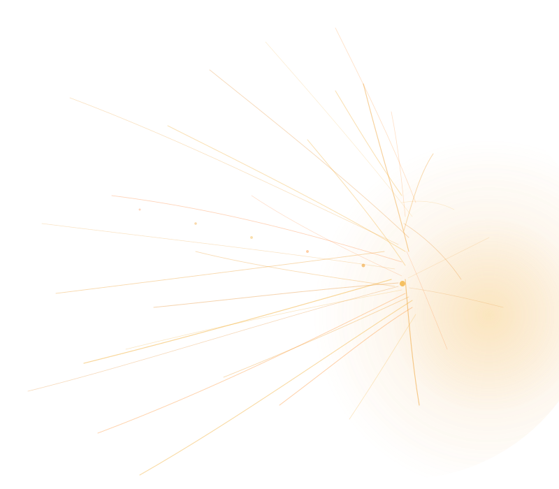

<section class="cf-home-hero" aria-labelledby="cf-home-title">

LocalObserve-onlyPre-alpha

<h1 id="cf-home-title" class="cf-home-hero__title">CursorFleet</h1>

Observe your local agent team from one terminal.

A local TUI and workflow harness for following parallel coding agents, their activity, and handoffs — without taking control of their work.

<a href="getting-started/installation/" class="cf-home-hero__btn cf-home-hero__btn--primary">Install</a>
<a href="getting-started/quickstart/" class="cf-home-hero__btn">Quickstart</a>
<a href="https://github.com/M9nx/cursorfleet" class="cf-home-hero__link" rel="noopener">View on GitHub</a>

Pre-alpha · Observe-only · Local-first

<a href="known-limitations/">Known limitations</a>

Unofficial project. Not affiliated with Anysphere.

</section>

<section class="cf-home-section cf-home-capabilities" aria-labelledby="cf-home-cap-title">

<h2 id="cf-home-cap-title" class="cf-home-section__title">What CursorFleet provides</h2>
<ul class="cf-home-capabilities__grid">
<li class="cf-home-card">
<svg viewBox="0 0 24 24" fill="none" stroke="currentColor" stroke-width="1.75"><circle cx="12" cy="12" r="3"/><path d="M3 12h3m12 0h3M12 3v3m0 12v3"/></svg>
<h3 class="cf-home-card__title">Observe</h3>

See agent activity and workflow state from one local interface.

</li>
<li class="cf-home-card">
<svg viewBox="0 0 24 24" fill="none" stroke="currentColor" stroke-width="1.75"><path d="M4 12h6l2-4 4 8 2-4h2"/></svg>
<h3 class="cf-home-card__title">Follow</h3>

Understand parallel tasks, handoffs, and progress without jumping between sessions.

</li>
<li class="cf-home-card">
<svg viewBox="0 0 24 24" fill="none" stroke="currentColor" stroke-width="1.75"><rect x="3" y="5" width="18" height="14" rx="2"/><path d="M7 9h10M7 13h6"/></svg>
<h3 class="cf-home-card__title">Stay local</h3>

CursorFleet observes local workflows and does not need to become the agent orchestrator.

</li>
</ul>

</section>

<section class="cf-home-section cf-home-preview" aria-labelledby="cf-home-preview-title">

<h2 id="cf-home-preview-title" class="cf-home-section__title">One terminal. Your whole agent team.</h2>

The Textual dashboard reads local hook telemetry and read-only git context. It is observe-only, provisional, and under active validation against live Cursor.

<a href="tui/overview/">TUI overview</a> · <a href="tui/current-status/">Current status</a>

cursorfleet tui · observe-only · lanes

<pre class="cf-home-terminal__body"><code>OVERVIEW
────────────────────────────────────────
WORKING     cf-writer    hooks + spool
PLANNING    cf-reviewer  read-only git
UNKNOWN     (no telemetry yet)

j/k move · Enter detail · q quit</code></pre>

</section>

<section class="cf-home-section cf-home-install" aria-labelledby="cf-home-install-title">

<h2 id="cf-home-install-title" class="cf-home-section__title">Get started</h2>

Not on PyPI yet — install from a git checkout (Python 3.11+ and git required).

<code id="cf-install-cmd">git clone https://github.com/M9nx/cursorfleet &amp;&amp; cd cursorfleet &amp;&amp; uv tool install .</code>
<button type="button" class="cf-home-install__copy" data-copy-target="cf-install-cmd">Copy</button>

<a href="getting-started/quickstart/">Quickstart</a> · <a href="getting-started/installation/">Full installation</a>

</section>

<footer class="cf-home-legal">

CursorFleet is an unofficial open-source project and is not affiliated with or endorsed by Anysphere or Cursor. &ldquo;Cursor&rdquo; is a trademark of its respective owner. CursorFleet is currently a working name.

</footer>

